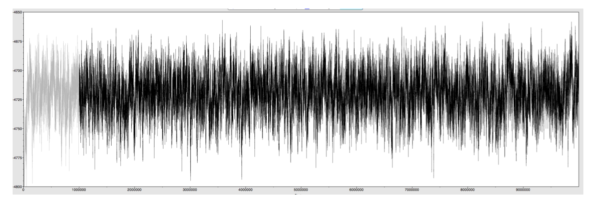

# BayesAss Edition 3.0 User’s Manual

Bruce Rannala

&copy;2007 University of California Davis

Last updated 6 Mar 2023

## 1 Installation

The latest version of BA3 (version 3.0.5) can be downloaded 
[here](https://github.com/brannala/BA3/releases). Unzip the archive by
double clicking the downloaded file. A folder will be created in your current directory
containing the source code and/or precompiled binary files for
various computer operating systems. There is also an examples directory containing two
example input files with samples from either 2 or 3 populations. If you have a compiler
and are adventurous you can try compiling the source code (see below), otherwise refer 
to the instructions below to use a precompiled binary file for your specific computer
operating system. There are two different executable files for each operating system. The
executable `BA3SNP` is intended for use with single nucleotide polymorphism (SNP) data and 
allows a maximum of 4 alleles per locus, 50,000 loci, 100 populations and 5,000 individuals. 
The executable `BA3MSAT` is intended for use with microsatellite (MSAT) data and allows a maximum
of 500 alleles per locus, 500 loci, 100 populations and 5000 individuals. In the examples and
discussion below the SNP program `BA3SNP` will often be used -- the commands are the same
for both `BA3SNP` and `BA3MSAT` -- you should always use the appropriate executable file for your
dataset (SNP or miscrosatellite).

### 1.1 Mac OS X
#### Using Homebrew package manager

The recommended way to install BA3 on Mac (or Linux) is using the [homebrew](https://brew.sh/) 
package manager. Once you have homebrew installed on your machine you can install BA3 using
the following commands (executed in the Terminal):
```
brew tap brannala/ba3
brew install ba3
```
The program will be installed and the commands `BA3SNP` and `BA3MSAT` will be available in
the Terminal. You will want to download the documentation and example files (BA3-docs-examples.zip) from 
[here](https://github.com/brannala/BA3/releases).

#### Using precompiled executables

Download the zip archived file with the latest version of the software 
[here](https://github.com/brannala/BA3/releases). Unzip the
archive by double clicking the downloaded file. A folder will be created in your current 
directory containing the program executable files `BA3SNP` and `BA3MSAT`, example data files (in subfolder
examples), and this manual (in subfolder docs). Note that there are two binaries available:
“M” for users of newer M1 or M2 CPU Macs and "I" for users of older Intel CPU Macs. The Intel executable
will run on M1/M2 Macs but this is through emulation and is not recommended.

### 1.2 Windows

Download the zip archived file with the latest version of the software [here](https://github.com/brannala/BA3/releases). 
Choose either the file `BA3Windows32.zip` or `BA3Windows64.zip` depending on whether you are running a 32 bit (older) 
or 64 bit (newer) version of Windows. Unzip the archive by double
clicking the downloaded file. A folder will be created in your current directory containing 
the program executable files `BA3SNP.exe` and `BA3MSAT.exe`, example data files (in subfolder examples), and
this manual (in subfolder docs). There are no longer any shared libraries that need to be
installed for the Windows version of BA3.

### 1.3 Linux

Download the zip or tar.gz archived file with the latest version of the software 
[here](https://github.com/brannala/BA3/releases). Unzip the
archive by double clicking the downloaded file. A folder will be created in your current 
directory containing the program executable files `BA3SNP` and `BA3MSAT`, example data files (in subfolder
examples), and this manual (in subfolder docs). 

### 1.3 Compiling the program

You do not need to compile the program if you have been successful following either
steps 1.1 or 1.2 above. The source code for the program is found in the source tarball
distribution file named BA3-*.*.*.tar.gz where * indicate the version numbers. The
program uses routines from the gnu scientific library (gsl) and this library (and header
files) must be installed prior to compiling. The gsl library can be found [here](https://www.gnu.org/software/gsl/). 
It is recommended that you install the gsl library using a package manager such
as apt in Ubuntu linux or homebrew on Macs. If using a
command line C++ compiler (e.g., g++, c++, etc), with gsl installed in the standard location, simply execute the
following terminal commands in the directory that contains the source tarball:
```
tar -xvzf BA3-*.tar.gz
cd BA3-*
./make all
```
This will create the executable files `BA3SNP` and `BA3MSAT`  in the current directory and typing ./BA3 at the command
prompt will then execute the program. The procedures for compiling in Windows using the Cygwin package are essentially identical.

## 2 Running the program

The BA3 program is a command line program. If you are familiar with the unix terminal 
you will find it straightforward to use as it adheres to standard unix conventions for
command line options, etc. If you have never used a terminal (command line) program
you can find a beginners guide [here](https://people.ischool.berkeley.edu/~kevin/unix-tutorial/toc.html). 
Detailed instructions for running the program on
the Mac OS X (or other unix-based) operating system are provided below.

### 2.1 Getting BA3 up and running on Mac OS X or Unix
#### 2.1.1 Running BA3 installed with Homebrew
Download the examples and documentation `BA3-docs-examples.zip` and uncompress. If you uncompress 
the files on your desktop then in the Terminal type:
```
cd /Users/<login>/Desktop/BA3-docs-examples
```
to run a 3 population example dataset using the microsatellite version of the program type:
```
BA3MSAT -v examples/3pop.txt
```
You can also test the SNP version of the program since the example datasets only have 2 alleles per locus:
```
BA3SNP -v examples/3pop.txt
```
Note that in the examples that follow the prefix `./` is used before the program command name (e.g., `BA3SNP`), for example
```
./BA3SNP -v test.txt
```
This prefix represents the current working directory in Unix and should only be used when the executable files
were manually installed and the program is being run from the directory containing the executable files.
If you installed the program using Homebrew then the executables will already be in your path and so the prefix is not needed.
You would instead execute the above command as
```
BA3SNP -v text.txt
```
If you incorrectly use the prefix Unix will complain that the executable file does not exist
`./BA3SNP: No such file or directory`.
#### 2.1.2 Running BA3 installed from binaries on Mac or Linux
To run the program, you will first need to start the terminal application which can be
found in the Applications/Utilities folder on a Mac. A short tutorial on using the Mac OS
X terminal can be found [here](https://www.library.unlv.edu/sites/default/files/inline-images/wRkOVKa8PENf9196S4Q6Kpjbo7QwuzviXOI20clS9QHEPtJQY6.pdf). 
The following description assumes that you have unzipped
the BA3 distribution file on the Desktop. If you have placed it elsewhere you will need to
change the commands to indicate the correct file path. Once you open terminal you will
see a command line prompt. On a Mac, at the prompt type:
```
cd /Users/<login>/Desktop/BA3.*/binary/macosx
```
where <login> is replaced with your account login name. On another unix computer you
will specify the path to the binary that you unpacked (or compiled from source code).
The unix command cd is short for “change directory” and the above command changes
the current working directory from the user’s home directory (the default) to the directory 
where the BA3 program binary resides. To run the program using an example data
file with 3 populations (contained in the subdirectory examples) type the following command:
```
./BA3SNP -v examples/3pop.txt
```
The prefix ./ means “current directory” and tells the operating system to look for the
program file named BA3 in the current working directory. The program option -v specifies
“verbose” output and causes BA3 to print out more detailed information to the screen
when the program is running. 
#### 2.1.3 Program screen output
You should see output similar to the following:
```

                       BayesAss Edition 3.0.5 (BA3)
                           Released: 3/6/2023
                               Bruce Rannala
               Department of Evolution and Ecology at UC Davis

Input file: examples/3pop.txt
Output file: BA3out.txt
Individuals: 400 Populations: 3 Loci: 7 Missing genotypes: 6

Locus:(Number of Alleles)

loc0:2 loc1:3 loc2:3 loc3:3 loc4:2 loc5:2 loc6:2

logP(M): -1618.34 logL(G): 0.00 logL: -1618.34 % done: (0.10) % accepted: (0.14, 0.83, 1.00, 1.00, 1.00)
logP(M): -1619.67 logL(G): 0.00 logL: -1619.67 % done: (0.20) % accepted: (0.15, 0.83, 1.00, 1.00, 1.00)
logP(M): -1621.13 logL(G): 0.00 logL: -1621.13 % done: (0.30) % accepted: (0.15, 0.83, 1.00, 1.00, 1.00)
logP(M): -1625.90 logL(G): 0.00 logL: -1625.90 % done: (0.40) % accepted: (0.15, 0.83, 1.00, 1.00, 1.00)
logP(M): -1622.89 logL(G): 0.00 logL: -1622.89 % done: (0.50) % accepted: (0.15, 0.83, 1.00, 1.00, 1.00)
logP(M): -1620.15 logL(G): 0.00 logL: -1620.15 % done: (0.60) % accepted: (0.15, 0.83, 1.00, 1.00, 1.00)
logP(M): -1619.98 logL(G): 0.00 logL: -1619.98 % done: (0.70) % accepted: (0.15, 0.83, 1.00, 1.00, 1.00)
logP(M): -1622.04 logL(G): 0.00 logL: -1622.04 % done: (0.80) % accepted: (0.15, 0.83, 1.00, 1.00, 1.00)
logP(M): -1617.66 logL(G): 0.00 logL: -1617.66 % done: (0.90) % accepted: (0.15, 0.83, 1.00, 1.00, 1.00)
logP(M): -1619.30 logL(G): 0.00 logL: -1619.30 % done: (1.00) % accepted: (0.15, 0.83, 1.00, 1.00, 1.00)

MCMC run completed. Output written to BA3out.txt
```
The program will create an output file in the current working directory when it has
finished running. By default the output file is named BA3out.txt. You can double click on
this file to open it with the Mac text editor and see the results.

### 2.2 Getting BA3 up and running on Windows

You will first need to run the Windows ”Command Prompt” program which will open a
console that you can use to run the `BA3SNP.exe` or `BA3MSAT.exe` programs. At the command prompt use the
”cd” command to move to the directory where the files `BA3SNP.exe` and `BA3MSAT.exe` are found. For example,
```
C:\Users\bruce>cd Desktop\BA3Windows32
C:\Users\bruce\Desktop\BA3Windows32
```
To run the example file 3pop.txt verbosely use the command:
```
C:\Users\bruce\Desktop\BA3Windows32>BA3MSAT.exe -v examples\3pop.txt
```
## 3 Data file format

The BA3 program uses an input file format that is identical to that of earlier BayesAss
releases. The input file should be in a plain text format. DO NOT use a word processor
such as Word to create the input file without explicitly converting it to a text file format
before use. One possible approach is to input the data into a spreadsheet program such as
Excel and then save the file as a “space-delimited text file.” Another approach is to install
one of the many available free text editors such as emacs or vi on your computer. Each
line of the input file should have the following format
```
indivID popID locID allele1 allele2
```
where `indivID` is a unique identifier for the individual, `popID` is a unique identifier of the
individual’s source population, `locID` is a unique identifier for the locus, and `allele1`
and `allele2` are the allele labels for each allele of the individual’s genotype. The order of
the alleles on the line is arbitrary. Missing alleles are represented using a 0. If there are n
individuals and L loci there will be n × L lines in the input file. See the example data files
distributed with the program.

## 4 Command line options

The BA3 program has about a dozen command line options that allow you to control
the way the program runs and the level of detail in the output that it produces. The
command line options are given after the program name and before the input file name.
For example,
```
./BA3SNP -v -i=10000000 -o myout.txt myin.txt
```
executes the program for 1 million iterations using verbose output, writing the output to
the file myout.txt and using the input file myin.txt. Some options such as the option
specifying the number of iterations, `-i`, take parameter values while others such as `-v`
do not. Parameter values should follow the option specifier and may, or may not, be
separated from the option specifier by a space. For example, the following
are all equivalent ways to specify 1,000,000 iterations:
```
./BA3SNP -i1000000 myin.txt
./BA3SNP -i 1000000 myin.txt
./BA3SNP -i  1000000 myin.txt
```
Table 1 lists all the command line options with a brief description of their parameters and
effects. Each option is described in detail in the remainder of this section. Following Unix
conventions, each command line option has two possible forms, a short (one letter) form
preceded by - and a longer, one word form preceded by --, for example the ”verbose
output” command can be specified on the command line as either `-v` or `--verbose`. The
longer forms are available solely because some persons find them easier to remember.

| Option            | Values                  | Effect                                      |
|:------------------|:------------------------|:--------------------------------------------|
| -a --deltaA       | $0 < \Delta_A \leq 1.0$ | Mixing parameter for allele frequencies     |
| -b --burnin       | Positive integer        | Number of iterations to discard as burnin   |
| -f --deltaF       | $0 < \Delta_F \leq 1.0$ | Mixing parameter for inbreeding coefficients |
| -g --genotypes    | None                    | Output genotypes and migrant ancestries     |
| -i --iterations   | Positive integer        | Number of iterations for MCMC               |
| -m --deltaM       | $0 < \Delta_M \leq 1.0$ | Mixing parameter for migration rates        |
| -n --sampling     | Positive integer        | Interval between samples for MCMC           |
| -o --output       | String                  | Output file name                            |
| -s --seed         | Positive integer        | Seed for random number generator            |
| -p --nolikelihood | None                    | Fix likelihood to 1 and generate priors     |
| -t --trace        | None                    | Create a trace file to monitor convergence   |
| -u --settings     | None                    | Output options and parameter settings       |
| -v --verbose      | None                    | Use verbose screen output                   |

**Table 1:** Options available for BA3 program

### 4.1 Random number generator seed

The option -s (--seed) is used to specify a positive integer used to ”seed” the random
number generator algorithm. A deterministic algorithm is used to generate pseudorandom 
numbers during the MCMC such that the sequence of random numbers is entirely determined 
by the starting seed. Thus, separate runs of the program started using
same seed will produce exactly the same outcome. To test whether the program is converging 
it is important to carry out several independent runs initiated with different seeds.
To start the program using 10456 as the random number seed use the following command:
```
./BA3SNP -s104656
```
If no seed is specified the default seed is 10.

### 4.2 MCMC iterations, burn-in and sampling interval

The command line option -i (--iterations) specifies the number of iterations for the
Markov chain Monte Carlo (MCMC) analysis. By default the program uses 5,000,000 
iterations. The number of iterations is an important factor in determining whether a MCMC
analysis has converged (see below). In general, a greater number of iterations will be more
likely to insure convergence but the run-time of the program also increases in proportion
to the number of iterations. The value of the number of iterations should be a positive
integer. For example,
```
.\BA3 -i10000000 test.txt
```
will execute the program using the data file test.txt and carry out 10 million iterations. The
option -b (--burnin) is used to specify a positive integer that is the number of iterations
of the MCMC that are discarded before sampling begins to obtain a sample of values that
will be used to estimate parameters. Burn-in length is chosen such that the chain is likely
to have reached the stationary distribution before sampling begins. The burn-in length
must obviously be less than the total number of iterations. For example,
```
./BA3SNP -i10000000 -b1000000 test.txt
```
will run the MCMC for 10 million iterations, discarding the first 1 million iterations. In
this case, 9 million iterations are available for sampling. The option -n (--sampling) is
used to specify a positive integer that is the interval between samples. This interval must
obviously be less than the number of iterations minus the burn-in, but will typically be
much smaller, perhaps 100 or 1000. For example,
```
./BA3SNP -i10000000 -b1000000 -n1000 test.txt
```
will run the MCMC for 10 million iterations, discarding the first 1 million iterations and
sampling every 1000 iterations from the remaining 9 million iterations, producing a 
sample of 9000 observations from the chain that will be used to estimate parameters.

### 4.3 MCMC mixing parameters

For continuous parameters such as migration rates, allele frequencies and inbreeding 
coefficients, the size of the proposed change to the parameter value at each iteration of the
MCMC can be adjusted. These adjustments are used to fine-tune the acceptance rates
for proposals (see discussion below). There are 3 mixing parameter adjustments: -a
(--deltaA), -f (--deltaF) and -m (--deltaM) that adjust the proposal size for the allele
frequencies, inbreeding coefficients and migration rates, respectively. Each mixing 
parameter should be a number between 0 and 1, with the size of the proposed move being
proportional to the magnitude of this number.

### 4.4 Options for printing output

By default, the output produced by BA3 is written to a file named BA3out.txt that the
program creates in the current working directory. An alternative name for the output file
can be specified using the option -o (--output). For example,
```
./BA3SNP -o myout.txt test.txt
```
executes the program using the input file test.txt and writes the output to a file named
`myout.txt`. The option `-t (--trace)` specifies whether a trace output file is created that
lists all the parameter values at each iteration of the MCMC run. If this option is specified
a file named `BA3trace.txt` is created in the current working directory. This file can be
used to monitor convergence of the MCMC by plotting the profile of the likelihood and
prior values, as well as those of various parameters, over time, using a program such as
Tracer (see below). The option `-g` causes detailed information regarding the individual
multilocus genotypes and posterior probabilities of migrant ancestries to be written to a
file named `BA3indiv.txt` created in the current working directory. The option `-u` specifies
that current values of command line options are printed at the beginning of the output
file (recommended). Finally, the option `-v (--verbose)` specifies that detailed information
about the input data (number of populations. number of loci, number of individuals, and
so on) is written to the computer screen during the run and that likelihoods and parameter
acceptance rates are written to the computer screen as the program runs (recommended).
This detailed output can be used to adjust mixing parameters during initial trial runs (see
below). It is also useful for checking that the input file is in the correct format and the data
are being read correctly by the program.

## 5 Recommendations for running BA3

To generate correct results using BA3 it is important to adjust the mixing parameters,
use a sufficient number of iterations, discard enough iterations as burn-in, and carry out
several independent runs (started with different random number seeds), examining the
trace files for evidence of convergence and mixing and looking for consistency of the
estimates between independent runs. Here I will outline a general strategy for achieving
this. I illustrate the strategy using the example data file `3pop.txt`. I will begin with an
explanation of the screen output generated using option `-v`.

### 5.1 Understanding BA3 screen output

Running the BA3 program using the command `./BA3SNP -v examples/3pop.txt` produces
the following screen output:
```

                       BayesAss Edition 3.0.5 (BA3)
                           Released: 3/6/2023
                               Bruce Rannala
               Department of Evolution and Ecology at UC Davis

Input file: examples/3pop.txt
Output file: BA3out.txt
Individuals: 400 Populations: 3 Loci: 7 Missing genotypes: 6

Locus:(Number of Alleles)

loc0:2 loc1:3 loc2:3 loc3:3 loc4:2 loc5:2 loc6:2
```
The first two lines of screen output (following the program title) specify the names of the
input and output files. The next line prints the number of individuals (in this case, 400),
the number of populations (in this case, 3), the number of loci (in this case, 7), and the
total number of missing genotypes (in this case, 6). This is followed by a line specifying
the number of alleles present at each locus. You should check that all these values agree
with the expectations for your data. Discrepancies can indicate that there is a formatting
error and the input file is not being read correctly. Once the MCMC begins running the
current state of the chain will be printed to screen as follows:
```
logP(M): -1618.76 logL(G): -3087.23 logL: -4705.99 % done: [0.07]
% accepted: (0.31, 0.25, 0.66, 0.76, 0.60)
```
The first value `logP(M)` is the log probability of the current configuration of migrant 
ancestries among individuals, conditional on the current migration rates. The second value
`logL(G)` is the log-likelihood of the genotype data given the migrant ancestries of 
individuals and the current population allele frequencies. The third value logL is the sum of
these two terms. The value in brackets (or parentheses) after done is the percentage of the
total iterations that have been completed. This proportion is displayed in square brackets
if the chain is still in the burn-in phase, otherwise it is displayed in parentheses. The final
output after % accepted is the acceptance rate for proposed changes to each of the 5 
parameters from left to right: 

1. migration rates 
2. individual migrant ancestries
3. allele frequencies 
4. inbreeding coefficients
5. missing genotypes

### 5.2 Adjustment of mixing parameters

The acceptance rates for proposed changes to parameters 1, 3 and 4 in the above list 
(migration rates, allele frequencies and inbreeding coefficients, respectively) can be adjusted
by changing the values of the respective mixing parameters. If the acceptance rate is too
high, the chain does not mix well, often proposing values very near the current value
(which are accepted) and failing to adequately explore the state space. If the acceptance
rate is too low the chain rarely accepts the proposed moves which are too different from
the current value – this also causes poor mixing. Empirical analyses suggest that an 
acceptance rate between 20% and 60% is optimal. In the above example, the acceptance rate
for proposed changes to migration rate is about 31% which is adequate. However, the 
acceptance rates for proposed changes to the allele frequencies and inbreeding coefficients
are 66% and 76% respectively, which are both a bit high. One can decrease the acceptance 
rate by proposing larger moves (or increase the rate by proposing smaller ones). In
this case, we want to decrease the acceptance rate so we will try increasing the proposal
step size for the mixing parameters associated with proposed moves of both the allele 
frequencies and inbreeding coefficients. The default values of all the mixing parameters are
0.10. We will try increasing the proposal step length to 0.30 for both these proposals. Stop
the program by typing Control-C in the terminal, then start it again using the following
command options:
```
./BA3SNP -v -a0.30 -f0.30 examples/3pop.txt
```
The output from the MCMC run is now as follows:
```
logP(M): -1618.75 logL(G): -3142.41 logL: -4761.16 % done: [0.07]
% accepted: (0.31, 0.24, 0.31, 0.45, 0.60)
```
This is much better, but the acceptance rate for proposed changes to the inbreeding coef-
ficients is still a bit high at 45%. We therefore again kill the program run using `Control-C`
and try again with the following mixing parameters:
```
./BA3SNP -v -a0.30 -f0.50 examples/3pop.txt
```
The output from the MCMC run is now as follows:
```
logP(M): -1618.38 logL(G): -3115.25 logL: -4733.63 % done: [0.08]
% accepted: (0.31, 0.24, 0.32, 0.33, 0.60)
```
The acceptance rates now look okay so we will next try some longer runs with these
values for the mixing parameters and create a trace file to examine convergence. Note
that it may not always be possible to obtain acceptance rates in the recommended target
range. If the likelihood surface is very flat, for example, as may occur with weakly 
informative data, acceptance rates above 0.6 may occur even with a proposal step length of 1.
In such cases, the mixing may still be satisfactory as indicated by the trace plot or other
MCMC diagnostics. Also note that because the individual migrant ancestry and the miss-
ing genotypes are both discrete parameters the proposal step lengths are not adjustable
and the maximum achievable acceptance rate is

$\max P_{accept} = 2(1 − P_{max}),$

where $P_{max}$ is the largest posterior probability associated with any of the parameters. For
example, if migrant ancestry state 0 (non-migrant) has posterior probability $0.95$ then the
maximum posterior acceptance rate is $2(1 − 0.95) = 0.10$. Thus, for some datasets the
posterior acceptance rates for these parameters may be very small but the MCMC results
are still reliable. Enter the following to initiate a longer run with the random seed 100,
creating a trace file and printing the output to a file named `run1out.txt`:
```
./BA3SNP -v -a0.30 -f0.50 -t -s100 -i10000000 -b1000000 -n100 \
-o run1out.txt examples/3pop.txt
```

### 5.3 Interpreting the output file

The contents of the output file run1out.txt are as follows:
```
Input file: examples/3pop.txt
Individuals: 400 Populations: 3 Loci: 7

Locus:(Number of Alleles)

loc0:2 loc1:3 loc2:3 loc3:3 loc4:2 loc5:2 loc6:2

Population Index -> Population Label:

0->pop0 1->pop1 2->pop2

Migration Rates:

m[0][0]: 0.9718(0.0115) m[0][1]: 0.0130(0.0100) m[0][2]: 0.0152(0.0090)
m[1][0]: 0.0878(0.0141) m[1][1]: 0.7338(0.0396) m[1][2]: 0.1784(0.0407)
m[2][0]: 0.0870(0.0179) m[2][1]: 0.2047(0.0326) m[2][2]: 0.7083(0.0292)

Inbreeding Coefficients:

pop0 Fstat: 0.2552(0.0367)
pop1 Fstat: 0.0810(0.0588)
pop2 Fstat: 0.2698(0.0891)

Allele Frequencies:

pop0
loc0>>
2:0.806(0.029) 1:0.194(0.029)
loc1>>
3:0.309(0.033) 2:0.601(0.035) 1:0.089(0.020)
loc2>>
2:0.751(0.031) 3:0.170(0.027) 1:0.078(0.018)
loc3>>
2:0.384(0.035) 1:0.292(0.032) 3:0.324(0.032)
loc4>>
1:0.825(0.028) 2:0.175(0.028)
loc5>>
2:0.234(0.031) 1:0.766(0.031)
loc6>>
2:0.237(0.031) 1:0.763(0.031)

pop1
loc0>>
2:0.512(0.065) 1:0.488(0.065)
loc1>>
3:0.323(0.068) 2:0.445(0.070) 1:0.232(0.075)
loc2>>
2:0.222(0.062) 3:0.593(0.061) 1:0.186(0.054)
loc3>>
2:0.663(0.069) 1:0.325(0.071) 3:0.012(0.012)
loc4>>
1:0.266(0.071) 2:0.734(0.071)
loc5>>
2:0.750(0.049) 1:0.250(0.049)
loc6>>
2:0.868(0.058) 1:0.132(0.058)

pop2
loc0>>
2:0.479(0.077) 1:0.521(0.077)
loc1>>
3:0.451(0.083) 2:0.176(0.068) 1:0.374(0.080)
loc2>>
2:0.195(0.070) 3:0.433(0.077) 1:0.372(0.072)
loc3>>
2:0.465(0.069) 1:0.506(0.069) 3:0.029(0.017)
loc4>>
1:0.121(0.068) 2:0.879(0.068)
loc5>>
2:0.862(0.053) 1:0.138(0.053)
loc6>>
2:0.779(0.062) 1:0.221(0.062)
```
The first few lines of output summarize properties of the data. Next, there is a line
that maps an integer index to each population label. This is done simply to allow the
between population migration matrix to be printed more concisely. Next is the matrix
of inferred (posterior mean) migration rates and the standard deviation of the marginal
posterior distribution for each estimate. A rough 95% credible set can be constructed as
$\textrm{mean} \pm 1.96 \times \textrm{sdev}$. Note that `m[i][j]` is the fraction of individuals in population i that
are migrants derived from population j (per generation). Next are the mean posterior
estimates (and standard errors) of inbreeding coefficients and allele frequencies for each
locus and population.

### 5.4 Diagnosing convergence

Two simple ways to examine convergence are: 

- conduct multiple runs initialized with different seeds and compare the posterior mean parameter estimates for concordance. 
- analyze the trace file for each run using the Tracer program (available here). 

The trace file for the log-probability of the above run is plotted in Figure 1. The burn-in iterations are
indicated in light grey, sample iterations in black. Two things should be observed. First,
the log-probability initially increases steeply during the burn-in phase but then oscillates
around a plateau – this is often (but not always) the case when a chain as converged.
Second, the oscillations are quite regular – there are no persistant lows or highs (valleys
or hills) in the plot – this is one indication that the chain is mixing well and effectively
sampling from the posterior distribution with less autocorrelation between successive
samples of the chain than would be the case if valleys and hills existed. The analysis
of MCMC output is a generic problem and lots of programs are available (in R and other
statistics packages) for analysing the results produced by BA3.



**Figure 1:** Trace file for log probability in a BA3 analysis of example input file 3pop.txt
created using the Tracer program


### 5.5 Interpreting the individual ancestry output in BA3indiv.txt

If the command line option `-g` is used the file `BA3indiv.txt` is created in the current 
working directory at the end of the MCMC run. If we use the command
```
./BA3SNP -v -g -a0.30 -f0.50 -t -s100 -i10000000 -b1000000 -n100 \
-o run1out.txt examples/3pop.txt
```
this produces a `BA3indiv.txt` file containing an entry for each individual such as the
following (I have only included a few individuals here for illustration):
```
Individual: ind0 Source Popln: 0
Genotypes>>
loc0:2/2 loc1:3/3 loc2:2/2 loc3:2/2 loc4:?/? loc5:2/1 loc6:2/1
Migrant ancestry>>
[0,0]:0.931 [1,0]:0.000 [2,0]:0.000
[0,1]:0.000 [1,1]:0.002 [2,1]:0.001
[0,2]:0.000 [1,2]:0.035 [2,2]:0.031
```
This entry is for individual ind0 sampled from population 0. The genotypes of the individual 
are listed first followed by the posterior probabilities of migrant ancestry. The
notation [i, j] : indexes the population source i and generation j (0=nonmigrant, 1=1st 
generation migrant, 2=second generation migrant) of migrant ancestry. For example, [0,0] is
the category of nonmigrants from population 0. If j = 0 the only possible non-zero entry
is the source population for the individual (in this example popullation 0). If j > 0 the
only possible non-zero entries are for populations other than the source population. In
this case, the probability that the individual is a non-migrant is 0.931, the probability that
it is a first-generation migrant from population 1 is 0.002, the probability that it is a second 
generation migrant from population 1 is 0.035, and so on. Below is another example
individual:
```
Individual: ind11 Source Popln: 0
Genotypes>>
loc0:2/2 loc1:1/1 loc2:2/3 loc3:1/1 loc4:2/2 loc5:2/1 loc6:2/2
Migrant ancestry>>
[0,0]:0.175 [1,0]:0.000 [2,0]:0.000
[0,1]:0.000 [1,1]:0.242 [2,1]:0.483
[0,2]:0.000 [1,2]:0.031 [2,2]:0.069
```
Here the individual appears most likely to be a first generation migrant from population 2 
(probability 0.483) although there is also non-negligible probability associated with
the possibilities that the individual is either a non-migrant (probability 0.175) or a 
first-generation migrant from population 1 (probability 0.242).

### 5.6 The Priors

The prior on allele frequencies is uniform Dirichlet. So, with two alleles the prior means
are $1/2$, with three alleles they are $1/3$ and so on. The prior distribution of the F statistic
is uniform on the interval (0, 1) with a mean of $1/2$. The prior on migration rates is
uniform with the constraint that $m_{ii} \geq 2/3$ and $\sum_i\sum_{j \neq i} m_{ij} \leq 1/3$. The prior means for $n$
populations are

$\overline{m}_{ii} = \frac{1}{n} + \frac{2}{3} \left(\frac{n-1}{n}\right),$

and

$\overline{m}_{ij} = \frac{1}{3n} \,\, \mathrm{for} \,\, i \neq j.$

Estimates of the prior variances can be obtained by running the program with option
”p.” It is suggested that users compare the posterior densities for their data with these
prior densities to assess the change from prior to posterior which indicates how much
information is contained in the dataset.

